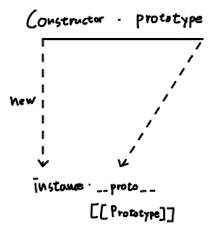
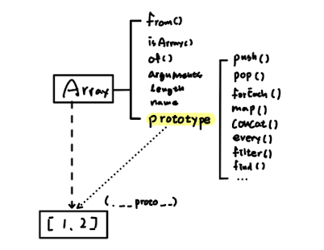
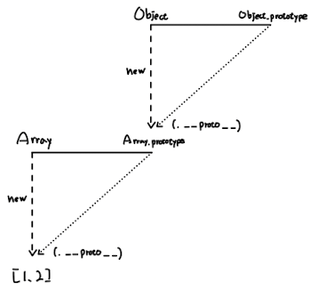

# 프로토타입의 개념 이해

## constructor, prototype, instance
```javascript
var instance = new Constructor();
```


  - 어떤 생성자 함수(Constructor)를 new 연산자와 함께 호출하면
  - Constructor에서 정의된 내용을 바탕으로 새로운 인스턴스(instrance)가 생성
  - 이때 instance에는 __proto__라는 프로퍼티가 자동으로 부여
  - 이 프로퍼티는 Constructor의 prototype이라는 프로퍼티 참조

**\_\_proto__라는 프로퍼티는 사실 [[prototype]]을 구현한 대상, 학습목적으로는 __proto__를 사용하되 실무에서는 Object.getPrototypeOf()/Object.create() 등 사용하기**

*\_\_proto__ 생략 가능, 읽을 때는 'dunder proto'('던더 프로토')

**배열 리터럴과 Array의 관계**



```javascript
var arr = [1, 2];
arr.forEach(function(){});  // (O)
Array.isArray(arr); // (O) true
arr.isArray();  // (x) TypeError: arr.isArray is not a function
```

## constructor 프로퍼티
생성자 함수의 프로퍼티인 prototype 객체 내부에는 constructor라는 프로퍼티가 있음. 인스턴스의 \_\_proto__ 객체 내부도 마찬가지, 이 프로퍼티는 원래의 생성자 함수(자기 자신)를 참조

```javascript
var arr = [1,2 ];
Array.prototype.constructor === Array  // true
arr.__proto__.constructor === Array  // true
arr.constructor === Array  // true

var arr2 = new arr.constructor(3, 4);
console.log(arr2);  // [3, 4]
```

정리
- 모두 동일한 대상 가르킴
  - [Constructor]
  - [instance].\_\_proto__.constructor
  - [instacne].constructor
  - Object.getPrototypeOf([instance]).constructor
  - [Constructor].prototype.constructor

- 모두 동일한 객체(prototype)에 접근할 수 있음.
  - [Constuctor].prototype
  - [instance].\_\_proto__
  - [instance]
  - Object.getPrototypeOf([instance])

# 프로토타입 체인

## 메서드 오버라이드
메서드 위에 메서드를 덮어씌웠다는 표현, 자바스크립트 엔진이 메서드를 찾는 방식은 가장 가까운 대상인 자신의 프로퍼티를 검색하고, 없으면 그다음으로 가까운 대상인 __proto__를 검색하는 순서로 진행

## 프로토타입 체인


```javascript
var arr = [1, 2];
arr(.__proto__).push(3);
arr(.__proto__)(.__proto__).hasOwnProperty(2);  //true

Array.prototype.toString.call(arr); // 1, 2
Object.prototype.toString.call(arr);  // [object Array]
arr.toString(); // 1, 2

arr.toString = function () {
  return this.join('_');
};

arr.toString(); // 1_2
```

어떤 데이터의 \_\_proto__ 프로퍼티 내부에 다시 \_\_proto__ 프로퍼티가 연쇄적으로 이어진 것을 프로토타입 체인(prototype chain)이라 하고, 이 체인을 따라가며 검색하는 것을 프로토타입 체이닝(prototype chaining)이라 함

## 객체 전용 메서드의 예외사항
객체만을 대상으로 동작하는 객체 전용 메서드들은 부득이 Object.prototype이 아닌 Object에 스태틱 메서드(static method)로 부여할 수밖에 없음

**왜?** Object.prototype이 여타의 참조형 데이터뿐 아니라 기본형 데이터조차 __proto__에 반복 접근함으로써 도달할 수 있는 최상위 존재이기 때문

*예외적으로 Object.create를 이용하면 Object.prototype의 메서드에 접근할 수 없는 경우가 있음(Object.create(null)은 __proto__가 없는 객체 생성)

## 다중 프로토타입 체인
'두 단계 이상의 체인을 지니는 다중 프로토타입 체인'도 가능


### 정리
- 어떤 생성자 함수를 new 연산자와 함께 호출하면 Constuctor에서 정의된 내용을 바탕으로 새로운 인스턴스 생성, 이 인스턴스에는 \_\_proto__ 라는, Constuctor의 prototype 프로퍼티를 참조하는 프로퍼티가 자동으로 부여.(이때, __proto__는 생략 가능한 속성이라서, 인스턴스는 Constructor.prototype의 메서드를 마치 자신의 메서드인 것처럼 호출 할 수 있음.)

- Constructor.prototype에는 constructor라는 프로퍼티가 있는데, 이는 다시 생성자 함수 자신을 가리킴. 이 프로퍼티는 인스턴스가 자신의 생성자 함수가 무엇인지를 알고자 할 때 필요함.

- \_\_proto__ 방향을 계속 찾아가면 최종적으로는 Object.prototype에 당도하게 됨. 이런 식으로 \_\_proto__를 찾아가는 과정을 프로토타입 체이닝이라고 하며, 이 프로토타입 체이닝을 통해 각 프로토타입 메서드를 자신의 것처럼 호출할 수 있음.(이때, 접근 방식4은 자신으로부터 가장 가까운 대상부터 점차 먼 대상으로 나아가며, 원하는 값을 찾으면 검색을 중단)

- Object.prototype에는 모든 데이터 타입에서 사용할 수 있는 범용적인 메서드만이 존재하며, 객체 전용 메서드는 여느 데이터 타입과 달리 Object 생성자 함수에 스태틱하게 담겨있음.

- 프로토타입 체인은 반드시 2단계로만 이뤄지는 것이 아니라 무한대의 단계를 생성할 수 있음.

```toc
```